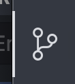
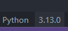

# CSC 323 Labs

---

## Authors
 - Trycia Vong [@Anamooz](https://github.com/Anamooz)
 - Brian Kwong [@Brian-Kwong](https://github.com/Brian-Kwong)

## Background

The following repository contains files for labs in **Cal Poly CSC323 Cryptographic Engineering**   
Each project is laid out in different directories for example `Lab 0` `Lab1` etc …  
An example file structure of this repository is laid out below  
The `readme_res` directory is used to store media such as images for constructing this README

```bash
./
└── lab0
    ├── ...
    ├── ...
└── lab1
└── lab2
.
.
.
└── readme_res
└── .gitignore
```

### Prerequisites

It is recommended you have the following applications installed before running any of these projects locally on your machine

Requirements specified in this README apply to all projects. Some particular labs may have additional libraries or newer versions of Python that are defined in that directory's README

1. [Python 3](https://www.python.org/downloads/) (\>=3.7)  
2. [Pip](https://pip.pypa.io/en/stable/installation/) (Python’s package manager)  
3. A text editor of your choice ([VS Code](https://code.visualstudio.com/download)[^1] is suggested)  
4. [Git](https://git-scm.com/downloads) [^2]with your [GitHub credentials linked](https://docs.github.com/en/authentication/connecting-to-github-with-ssh) 

## Running the Projects Locally 

### Cloning This Repository 

#### Through the Terminal

1. Change to the directory where you would like to clone the project to `cd <directory path`   
2. Run the following command to pull the project down from Github `git clone git@github.com:Anamooz/CSC323.git`

#### Through VS Code

1. Open VS Code   
2. Change to the directory where you would like the project to be cloned to `File` \> `Open Folder`  
3. Click Source Control  
4. Clone Project and provide the following URL `https://github.com/Anamooz/CSC323.git`

### Running a project 

Before running any project make sure you have installed all the prerequisites both from this README and the README within the project 

#### Through the terminal

1. Open the directory of a project you want to run `cd <lab #>` Ex: `cd ./lab0`  
2. To start a program run the Python file with the desired task  
   1. Python installed through Python.org  
      - `py ./<task#>.py` Ex : `py ./task2.py`   
   2. Windows (through MS Store)/macOS/Linux  
      - `python3 ./<task#>.py` Ex : `python3 ./task2.py` 

Some programs may require additional command line arguments.  Please check the README in that directory for those instructions   


#### Through VS Code

1. Open the directory of the project you want to run in VS Code `File` \> `Open Folder`  
2. Select the Python file you would like to run from the left file explorer  
3. Click the Python interpreter you want to use in the project by selecting the Python version at the bottom of VS code   
4. Click the Play triangle to execute the program  
   1. For any program that requires CL arguments, you will need to [create](https://code.visualstudio.com/docs/python/debugging) a `launch.json` by pressing CTRL(CMD on macOS) \+SHIFT+D then create launch.json

[^1]:  If you are using VS Code please also install the following extensions to get full compatibility with Python 1\. [Python Extension Pack](https://marketplace.visualstudio.com/items?itemName=donjayamanne.python-extension-pack) 2\. [Python Debugger](https://marketplace.visualstudio.com/items?itemName=ms-python.debugpy) 3\. [Pylance](https://marketplace.visualstudio.com/items?itemName=ms-python.vscode-pylance) 4\. [Isort](https://marketplace.visualstudio.com/items?itemName=ms-python.isort)

[^2]:  VS Code built in Source Control or Github Desktop are viable alternatives 